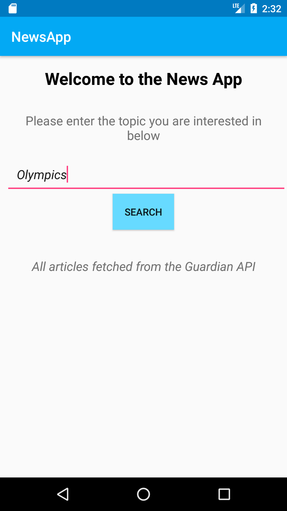
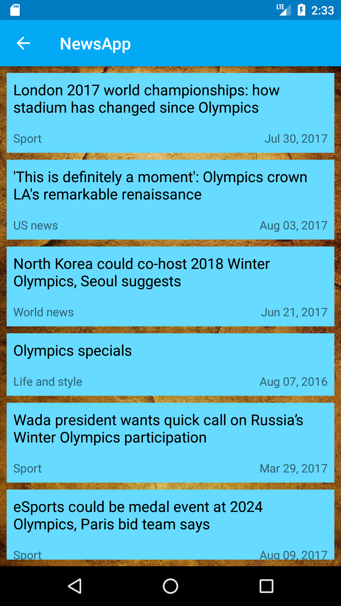

# NewsApp #
This app is built for the purpose of the project regarding Networking, part of the Android: Basics Nanodegree by Udacity and Google

 

## Summary ##
The user enters the topic that interests them and the app shows a list of related articles from the Guardian web site

## Details and functionality ##

-The user enters a search query

-The app sends an *HTTP request* of the query to the Guardian API and fetches the results in **JSON** format

-A list of related articles is returned, where the user can click on them to read the full story

## Built with ##
Android Studio
